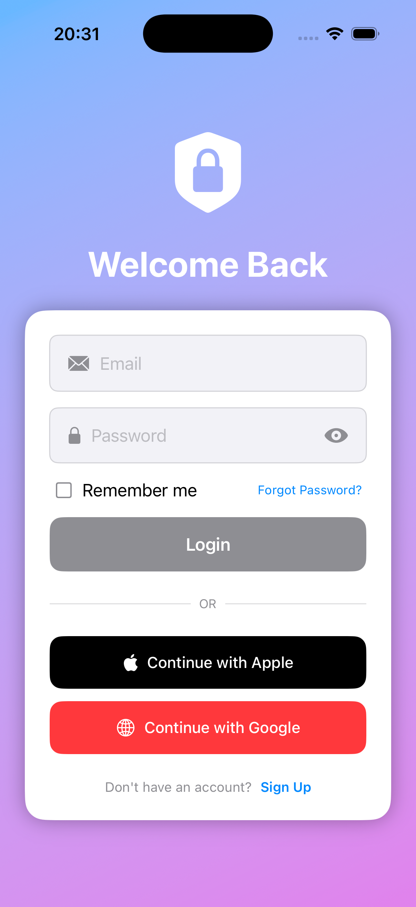
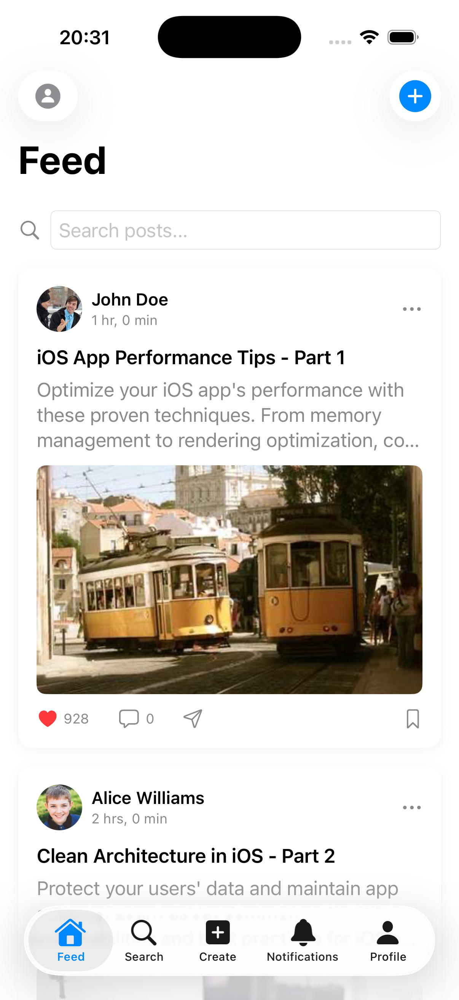
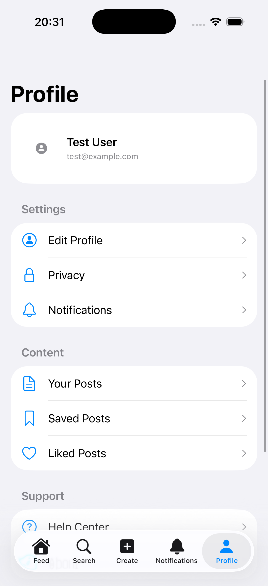

# BaseApp iOS Project

## 🏗 Giới thiệu

**BaseApp** là một project iOS được xây dựng theo kiến trúc **Modular Clean Architecture** nhằm hỗ trợ khả năng mở rộng, dễ dàng test, và tái sử dụng code.
Project bao gồm nhiều module tách biệt theo domain (Core, Features) và được quản lý trong workspace `BaseApp.xcworkspace`.

---

[English](README.md) | [Vietnamese](README-vi.md)

## 🔑 Tài khoản demo
```bash
Email: test@example.com
Password: password
```

## 📸 Demo

1. Login screen:



2. Feed screen:



3. Setting screen:



## 📂 Cấu trúc thư mục

```
.
├── BaseApp.xcworkspace     # Workspace chính, gom toàn bộ modules
├── BazelApp                # App target chính (UI + Entry point)
├── Core                    # Các module core (tái sử dụng, không phụ thuộc feature)
├── Features                # Các feature độc lập (Authentication, HomeFeed, ...)
```

### 1. **BazelApp**
- `BazelAppApp.swift` & `ContentView.swift`: Điểm khởi chạy của ứng dụng (SwiftUI).
- `Assets.xcassets`: Quản lý AppIcon, AccentColor, và các resource.
- `BazelAppTests` & `BazelAppUITests`: Unit tests và UI tests cho app chính.

### 2. **Core**
Chứa các module nền tảng dùng chung cho toàn bộ ứng dụng:
- **CoreData**: Quản lý persistence, network manager.
- **CoreDomain**: Định nghĩa entities và use cases cốt lõi.
- **CorePresentation**: Các component UI tái sử dụng.

### 3. **Features**
Mỗi feature được tách thành nhiều module con theo **Data - Domain - Presentation**:
- **Authentication**
  - `AuthenticationData`: Repository & data sources.
  - `AuthenticationDomain`: Use cases, business logic.
  - `AuthenticationPresentation`: ViewModel & UI (SwiftUI).
- **HomeFeed**
  - `HomeFeedData`: Repository cho bài viết/feed.
  - `HomeFeedDomain`: Use cases liên quan tới feed.
  - `HomeFeedPresentation`: ViewModel & UI (SwiftUI).

Mỗi feature đều có:
- **.docc**: Documentation Swift.
- **Tests**: Unit tests cho từng layer.

---

## ⚙️ Cách chạy project

1. Clone repo:
   ```bash
   git clone <repo-url>
   cd BaseApp
   ```

2. Mở workspace:
   ```bash
   open BaseApp.xcworkspace
   ```

3. Build & Run trên Xcode:
   - Chọn scheme `BazelApp`
   - Run (⌘ + R)

---

## 🧩 Kiến trúc

Project tuân theo **Clean Architecture** & **Modularization**:

- **Data layer**: Chịu trách nhiệm giao tiếp API/Database, implement repository.
- **Domain layer**: Chứa use cases, business rules, thuần Swift (không phụ thuộc framework).
- **Presentation layer**: SwiftUI Views + ViewModels (MVVM).
- **Core modules**: Chứa logic, entities và component có thể tái sử dụng bởi nhiều feature.

Lợi ích:
- Dễ dàng mở rộng thêm feature mới.
- Có thể test độc lập từng module.
- Tách biệt rõ giữa UI, business logic và data.

---

## 🧪 Testing

Mỗi module có thư mục `*Tests` riêng:
- Sử dụng **XCTest**.
- Có thể test độc lập bằng cách chạy scheme của module đó.

---

## 📖 Documentation

- Các module có folder `.docc` chứa tài liệu Swift DocC.
- Có thể build documentation trong Xcode (`Product > Build Documentation`).
