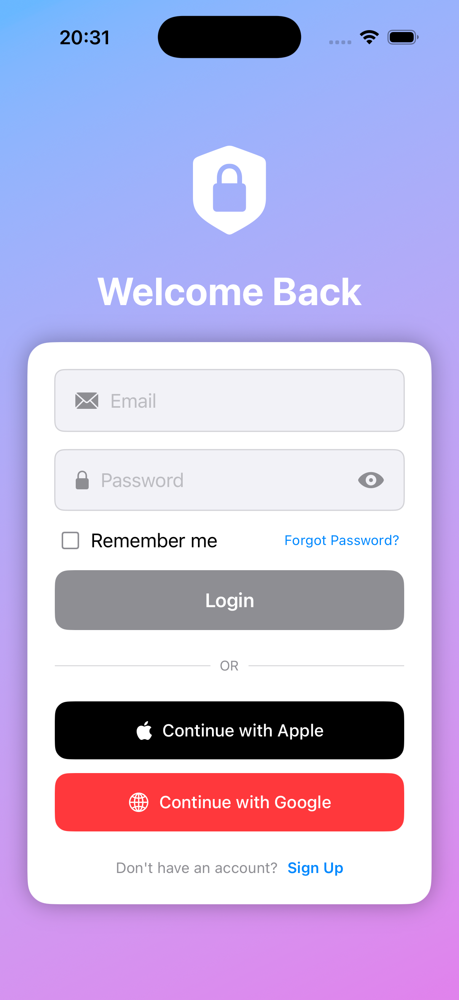

# BaseApp iOS Project

## 🏗 Introduction

**BaseApp** is an iOS project built with **Modular Clean Architecture** to support scalability, easy testing, and code reusability.

The project consists of multiple separate modules organized by domain (Core, Features) and is managed in the `BaseApp.xcworkspace` workspace.

---

[English](README.md) | [Vietnamese](README-vi.md)

## 🔑 Demo Account

```bash
Email: test@example.com
Password: password
```

## 📸 Demo

1. Login screen:


2. Feed screen:


3. Setting screen:


## 📂 Directory Structure

```
.
├── BaseApp.xcworkspace  # Main workspace, aggregates all modules
├── BazelApp            # Main app target (UI + Entry point)
├── Core                # Core modules (reusable, feature-independent)
├── Features            # Independent features (Authentication, HomeFeed, ...)
```

### 1. BazelApp

- `BazelAppApp.swift` & `ContentView.swift`: Application entry point (SwiftUI).
- `Assets.xcassets`: Manages AppIcon, AccentColor, and resources.
- `BazelAppTests` & `BazelAppUITests`: Unit tests and UI tests for the main app.

### 2. Core

Contains foundational modules shared across the entire application:

- **CoreData**: Manages persistence, network manager.
- **CoreDomain**: Defines core entities and use cases.
- **CorePresentation**: Reusable UI components.

### 3. Features

Each feature is separated into sub-modules following **Data - Domain - Presentation**:

- **Authentication**
  - `AuthenticationData`: Repository & data sources.
  - `AuthenticationDomain`: Use cases, business logic.
  - `AuthenticationPresentation`: ViewModel & UI (SwiftUI).

- **HomeFeed**
  - `HomeFeedData`: Repository for posts/feed.
  - `HomeFeedDomain`: Feed-related use cases.
  - `HomeFeedPresentation`: ViewModel & UI (SwiftUI).

Each feature includes:
- **.docc**: Swift documentation.
- **Tests**: Unit tests for each layer.

---

## ⚙️ How to Run the Project

1. Clone the repository:
   ```bash
   git clone <repo-url>
   cd BaseApp
   ```

2. Open the workspace:
   ```bash
   open BaseApp.xcworkspace
   ```

3. Build & Run in Xcode:
   - Select the `BazelApp` scheme
   - Run (⌘ + R)

---

## 🧩 Architecture

The project follows **Clean Architecture** & **Modularization**:

- **Data layer**: Responsible for API/Database communication, implements repositories.
- **Domain layer**: Contains use cases, business rules, pure Swift (framework-independent).
- **Presentation layer**: SwiftUI Views + ViewModels (MVVM).
- **Core modules**: Contains logic, entities, and components reusable by multiple features.

Benefits:
- Easy to add new features.
- Modules can be tested independently.
- Clear separation between UI, business logic, and data.

---

## 🧪 Testing

Each module has its own `*Tests` directory:
- Uses **XCTest**.
- Can be tested independently by running the module's scheme.

---

## 📖 Documentation

- Modules have `.docc` folders containing Swift DocC documentation.
- Documentation can be built in Xcode (`Product > Build Documentation`).