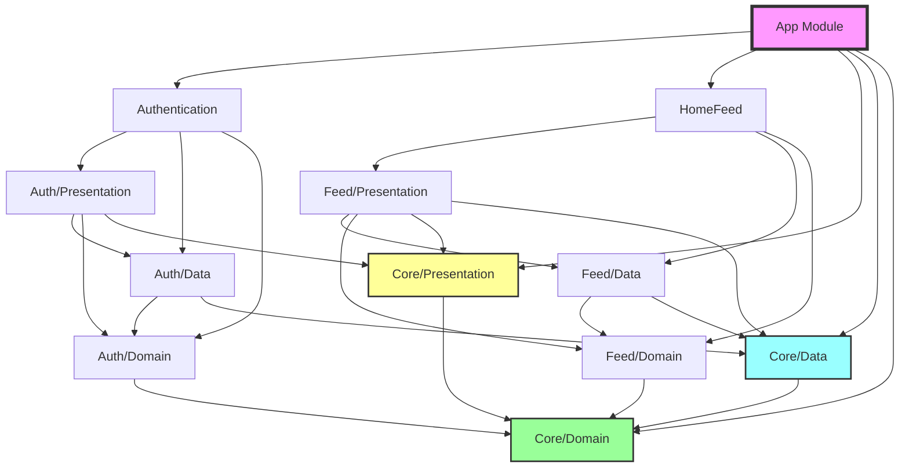

# iOS Clean Architecture with Bazel

This project demonstrates a production-ready iOS application built with **Clean Architecture**, **SwiftUI**, **Combine**, and **Bazel 8.4.1**.

## 🏗️ Architecture Overview

The project follows **Clean Architecture** principles with clear separation of concerns:

```
┌─────────────────────────────────────────────┐
│                 Presentation                 │
│         (SwiftUI Views + ViewModels)         │
├─────────────────────────────────────────────┤
│                    Domain                    │
│         (Use Cases + Entities)               │
├─────────────────────────────────────────────┤
│                     Data                     │
│      (Repositories + Network/Cache)          │
└─────────────────────────────────────────────┘
```

## 📁 Project Structure

```
.
├── Core/                    # Shared modules used by all features
│   ├── Domain/             # Base entities, protocols, errors
│   ├── Data/               # Network manager, cache, session
│   └── Presentation/       # Base ViewModels, UI components
│
├── Features/
│   ├── Authentication/     # Login/Register feature
│   │   ├── Domain/        # Auth use cases & protocols
│   │   ├── Data/          # Auth repository implementation
│   │   └── Presentation/  # Login/Register views & ViewModels
│   │
│   └── HomeFeed/          # Feed feature
│       ├── Domain/        # Post use cases & protocols
│       ├── Data/          # Post repository implementation
│       └── Presentation/  # Feed views & ViewModels
│
└── App/                    # Main application
    └── Sources/           # App entry point & configuration
```

## 🔗 Dependency Graph



## 🎯 Key Dependencies

### Core Modules
- **CoreDomain**: Has NO dependencies (pure Swift)
- **CoreData**: Depends on CoreDomain
- **CorePresentation**: Depends on CoreDomain

### Authentication Feature
- **AuthenticationDomain**: Depends on CoreDomain
- **AuthenticationData**: Depends on CoreDomain, CoreData, AuthenticationDomain
- **AuthenticationPresentation**: Depends on CoreDomain, CorePresentation, AuthenticationDomain, AuthenticationData

### HomeFeed Feature
- **HomeFeedDomain**: Depends on CoreDomain
- **HomeFeedData**: Depends on CoreDomain, CoreData, HomeFeedDomain
- **HomeFeedPresentation**: Depends on CoreDomain, CoreData, CorePresentation, HomeFeedDomain, HomeFeedData

### Cross-Feature Dependencies
HomeFeed depends on Core/Data's SessionManager to check authentication status when liking posts or creating content.

## 🚀 Build Commands

### Prerequisites
```bash
# Install Bazelisk
brew install bazelisk
```

### Build the app
```bash
# Build for simulator
bazelisk build //App:App --config=simulator

# Build for device
bazelisk build //App:App --config=device

# Build with debug configuration
bazelisk build //App:App --config=sim_debug

# Build with release configuration
bazelisk build //App:App --config=sim_release
```

### Build specific modules
```bash
# Build Core modules
bazelisk build //Core/Domain:CoreDomain
bazelisk build //Core/Data:CoreData
bazelisk build //Core/Presentation:CorePresentation

# Build Authentication feature
bazelisk build //Features/Authentication:Authentication

# Build HomeFeed feature
bazelisk build //Features/HomeFeed:HomeFeed
```

### Clean and rebuild
```bash
# Clean cache
bazelisk clean --expunge

# Check module dependencies
bazelisk mod graph
```

### Generate Xcode project
```bash
bazelisk run //:xcodeproj
open BzlmodApp.xcodeproj
```

## 🏛️ Clean Architecture Benefits

### 1. **Separation of Concerns**
- **Domain Layer**: Business logic independent of UI and data sources
- **Data Layer**: Handles all data operations (network, cache, database)
- **Presentation Layer**: UI and user interaction logic

### 2. **Testability**
- Each layer can be tested independently
- Use cases are pure business logic, easy to unit test
- Repository protocols allow easy mocking

### 3. **Maintainability**
- Changes in one layer don't affect others
- Easy to swap implementations (e.g., replace network layer)
- Clear boundaries between features

### 4. **Team Scalability**
- Teams can work on different features independently
- Clear interfaces between modules
- Parallel development without conflicts

## 📱 Features

### Authentication Module
- **Login**: Email/password authentication
- **Register**: New user registration
- **Session Management**: Persistent user sessions
- **Validation**: Input validation with clear error messages

### HomeFeed Module
- **Feed Display**: Paginated list of posts
- **Like/Unlike**: Interact with posts (requires login)
- **Create Post**: Share content with images
- **Search**: Find posts by title, content, or author
- **Post Details**: View full post with related content

## 🔄 Data Flow Example

Here's how a user login flows through the architecture:

1. **View** (LoginView) → User enters credentials
2. **ViewModel** (LoginViewModel) → Validates input, calls use case
3. **Use Case** (LoginUseCase) → Business logic validation
4. **Repository Protocol** (AuthenticationRepositoryProtocol) → Defines contract
5. **Repository** (AuthenticationRepository) → Makes network call
6. **Network Manager** → Handles HTTP request
7. **Session Manager** → Stores user session
8. **Response flows back** → User → ViewModel → View updates

## 🧪 Testing Strategy

```bash
# Run all tests
bazelisk test //...

# Test specific module
bazelisk test //Features/Authentication/...
bazelisk test //Features/HomeFeed/...
```

## 📦 Module Visibility

Bazel enforces strict visibility rules:
- Core modules are `//visibility:public`
- Feature sub-modules are only visible within their feature
- Main feature modules export their sub-modules

## 🎨 UI Components

### Shared Components (Core/Presentation)
- LoadingView
- ErrorView
- EmptyStateView
- PrimaryButtonStyle
- SecondaryButtonStyle
- BaseViewModel
- BaseCoordinator

### Authentication Components
- LoginView with animated gradient background
- RegisterView with form validation
- Social login buttons
- Password visibility toggle

### HomeFeed Components
- PostCardView with like/comment actions
- CreatePostView with image picker
- PostDetailView with related posts
- SearchBar with debounced search
- User avatar and menu

## 🔐 Authentication Flow

```
┌─────────────┐     ┌──────────────┐     ┌──────────────┐
│   LoginView │────▶│LoginViewModel│────▶│LoginUseCase  │
└─────────────┘     └──────────────┘     └──────────────┘
                            │                     │
                            ▼                     ▼
                    ┌──────────────┐     ┌──────────────┐
                    │SessionManager│◀────│AuthRepository│
                    └──────────────┘     └──────────────┘
                            │
                            ▼
                    ┌──────────────┐
                    │   MainApp    │
                    └──────────────┘
```

## 💉 Dependency Injection

The project uses constructor injection for better testability:

```swift
// ViewModel with injected dependencies
public init(
    loginUseCase: LoginUseCaseProtocol? = nil,
    logoutUseCase: LogoutUseCaseProtocol? = nil
) {
    let repository = AuthenticationRepository()
    self.loginUseCase = loginUseCase ?? LoginUseCase(repository: repository)
    self.logoutUseCase = logoutUseCase ?? LogoutUseCase(repository: repository)
}
```

## 🌐 Network Layer

### NetworkManager Features
- Async/await support
- Generic request handling
- Error mapping to domain errors
- Configurable base URL
- Request/response interceptors

### Mock Data
The app includes comprehensive mock data for development:
- 50+ sample posts
- 5 mock users with avatars
- Random images from Picsum
- Simulated network delays

## 📱 Session Management

### SessionManager Responsibilities
- Store current user
- Persist session across app launches
- Publish login state changes
- Clear session on logout

### Usage in Features
```swift
// Check if user is logged in
guard sessionManager.isLoggedIn else {
    throw DomainError.unauthorized
}

// Access current user
let currentUser = sessionManager.currentUser
```

## 🎯 Use Cases Examples

### Login Use Case
- Validates email format
- Validates password length
- Calls repository
- Returns user entity

### Create Post Use Case
- Validates title (max 200 chars)
- Validates content (max 5000 chars)
- Validates image size (max 10MB)
- Creates post via repository

### Fetch Posts Use Case
- Validates pagination parameters
- Fetches posts from repository
- Returns post array

## 🛠️ Development Workflow

### 1. Feature Development
```bash
# Create new feature structure
mkdir -p Features/NewFeature/{Domain,Data,Presentation}/Sources

# Add BUILD files for each layer
# Implement Domain → Data → Presentation
```

### 2. Adding Dependencies
```swift
// In BUILD.bazel
deps = [
    "//Core/Domain:CoreDomain",
    "//NewDependency:Module",
]
```

### 3. Running the App
```bash
# Build and generate Xcode project
bazelisk run //:xcodeproj

# Open in Xcode
open BzlmodApp.xcodeproj

# Select simulator and run
```

## 📊 Performance Optimizations

### Build Performance
- Incremental builds with Bazel
- Module-level caching
- Parallel compilation
- Remote caching support

### Runtime Performance
- Lazy loading of views
- Image caching with AsyncImage
- Debounced search
- Pagination for large lists

## 🔍 Code Quality

### SwiftLint Integration (Optional)
```python
# In BUILD.bazel
load("@SwiftLint//lint:defs.bzl", "swiftlint")

swiftlint(
    name = "lint",
    srcs = glob(["**/*.swift"]),
)
```

### Code Review Checklist
- [ ] Follows Clean Architecture principles
- [ ] Proper error handling
- [ ] No circular dependencies
- [ ] Unit tests included
- [ ] Documentation updated

## 🚦 CI/CD Integration

### GitHub Actions Example
```yaml
name: iOS Build

on: [push, pull_request]

jobs:
  build:
    runs-on: macos-latest
    steps:
      - uses: actions/checkout@v2
      - name: Install Bazelisk
        run: brew install bazelisk
      - name: Build
        run: bazelisk build //App:App --config=simulator
      - name: Test
        run: bazelisk test //...
```

## 📝 Best Practices

### 1. **Domain Layer**
- Keep it pure Swift (no UIKit/SwiftUI imports)
- Define clear entity models
- Use protocols for repositories
- Implement use cases for business logic

### 2. **Data Layer**
- Implement repository protocols
- Handle network/cache logic
- Map DTOs to domain entities
- Manage data sources

### 3. **Presentation Layer**
- Use MVVM pattern
- Keep views simple and declarative
- Handle UI state in ViewModels
- Use Combine for reactive updates

## 🐛 Debugging

### Common Issues

1. **Module not found**
```bash
# Check module visibility in BUILD file
visibility = ["//visibility:public"]
```

2. **Circular dependency**
```bash
# Run dependency graph
bazelisk mod graph
```

3. **Build cache issues**
```bash
# Clear and rebuild
bazelisk clean --expunge
bazelisk build //App:App
```

## 📚 Resources

- [Bazel Documentation](https://bazel.build)
- [Clean Architecture](https://blog.cleancoder.com/uncle-bob/2012/08/13/the-clean-architecture.html)
- [SwiftUI Documentation](https://developer.apple.com/xcode/swiftui/)
- [Combine Framework](https://developer.apple.com/documentation/combine)

## 🤝 Contributing

1. Follow Clean Architecture principles
2. Add appropriate tests
3. Update documentation
4. Ensure Bazel build passes
5. Create feature branch and PR

## 📄 License

This is a demo project for educational purposes.

---

## 🎉 Summary

This project demonstrates:
- ✅ **Clean Architecture** with clear separation of concerns
- ✅ **Modular design** with independent features
- ✅ **Pure SwiftUI & Combine** (no external dependencies)
- ✅ **Bazel 8.4.1** with Bzlmod configuration
- ✅ **Real-world features** (auth, feed, search, etc.)
- ✅ **Production-ready structure** scalable for large teams

The architecture ensures that changes in one module don't affect others, teams can work independently, and the codebase remains maintainable as it grows.
